# Program Committee Formation Web App

This web application assists academic conference organizers in forming a diverse, high-quality program committee using a data-driven, human-in-the-loop approach. It streamlines the process of candidate selection, ensuring diversity, reducing conflicts of interest, and enhancing user experience with intuitive workflows and real-time visualizations.

---

## Features

### 1. File Upload and Data Validation
- Upload candidate data in `.xlsx`, `.xls`, or `.csv` formats.
- Validate and match uploaded data to required fields: **Name**, **Email**, **Institute**, and **Country**.
- Automatically enrich candidate data with DBLP and co-author network information.

### 2. Candidate Management
- View, search, add, edit, and delete candidate data in a customizable table.
- Retain row selection state across sessions.
- Advanced search for column-specific filtering.

### 3. Iterative Decision-Making
- Input desired program committee size and identify the least-connected candidates to minimize conflicts of interest.
- Update candidate decisions (Accepted/Declined) for iterative selection rounds.
- Support for multiple iterations to refine committee formation.

### 4. Graph Visualizations
- View co-authorship networks for selected candidates.
- Analyze distribution graphs for expertise, country, gender, and other factors.
- Dynamically update graphs based on candidate selection.

## Installation Steps
1. npm install
2. npm start

Note: Need to clone/ download pc-rev-app and set up the SQL database (refer to pc-rev-app repo) for this to work

## Work Flow with Visualizations
1. Click on the UPLOAD FILE button
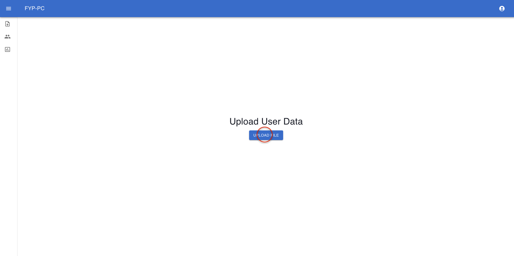
2. Click the Select file button to browse their local drive to upload .xlsx, .xls, or .csv files.
3. The file must include the columns NAME, EMAIL, INSTITUTE, AND COUNTRY. Any of these columns missing will prompt an error message.
4. After uploading a file, the modal will automatically proceed to step 2, which is to choose the header row. Clicking next will go to step 3, which is to macth the columns.
5. The last step is to validate the data. If the user is unsatisfied with some rows, they can select multiple rows to discard.
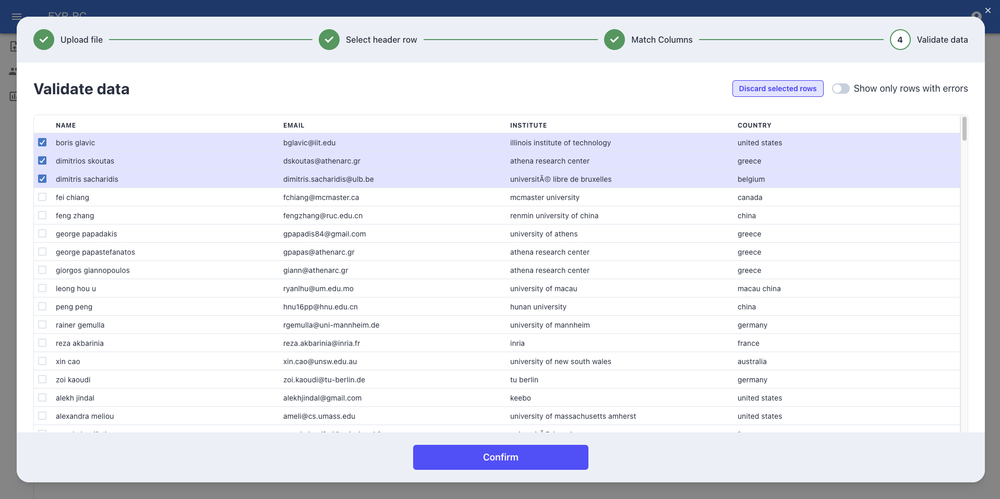
6. Toggling the ”Show only rows with errors” option will display rows with errors. In this case, the error is an empty cell for INSTITUTION in one of the rows. Since all fields are required, this will trigger the validation mechanism.
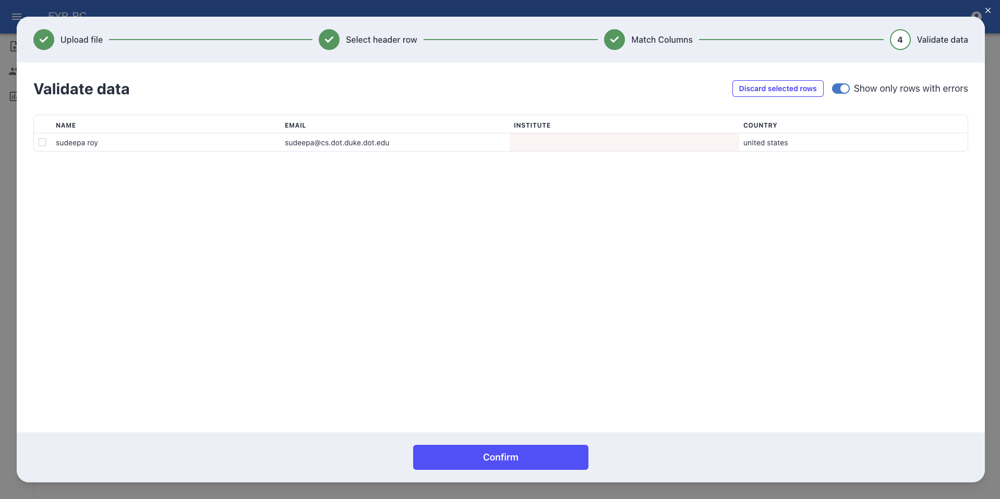
7. Double click to edit the fields
8. After validating the data, when the user clicks next, the system will iterate through the rows. In each iteration, the system will use the email input to find the corresponding DBLP link in SancusDB. After obtaining the DBLP link, it will web-scrape the relevant data from the webpage and store the information in the database. When the process completes, a dialog will pop up to indicate that the data was submitted successfully.
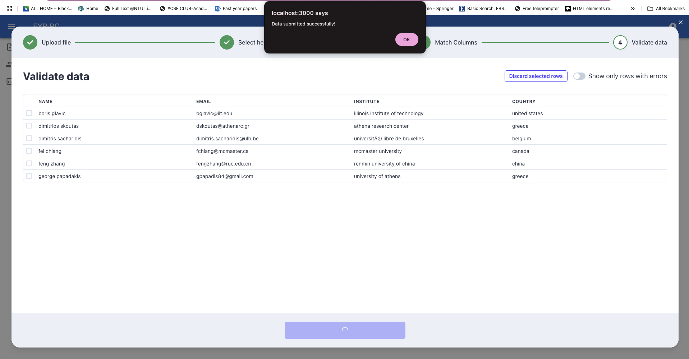
9. After clicking ’Done’ on the dialog, click on the Candidates Page to view the information in table format.
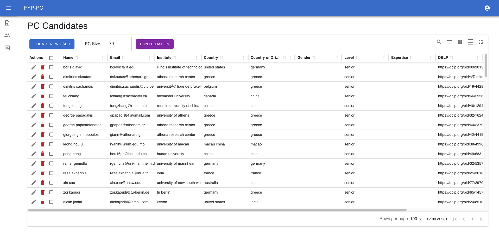
10. The user can edit the rows to input information or modify any other data.
11. The user can create a new user by clicking on the CREATE NEW USER button. The system will validate the fields, and the user cannot save the entry without fixing all validation errors.
12. After completing all data validation (searching, editing, and deleting data), if the user is satisfied with the potential PC candidates list, they can fill in the PC Size (default is 70) to generate the number of candidates they want and click the ’RUN ITERATION’ button to begin the COI calculation.
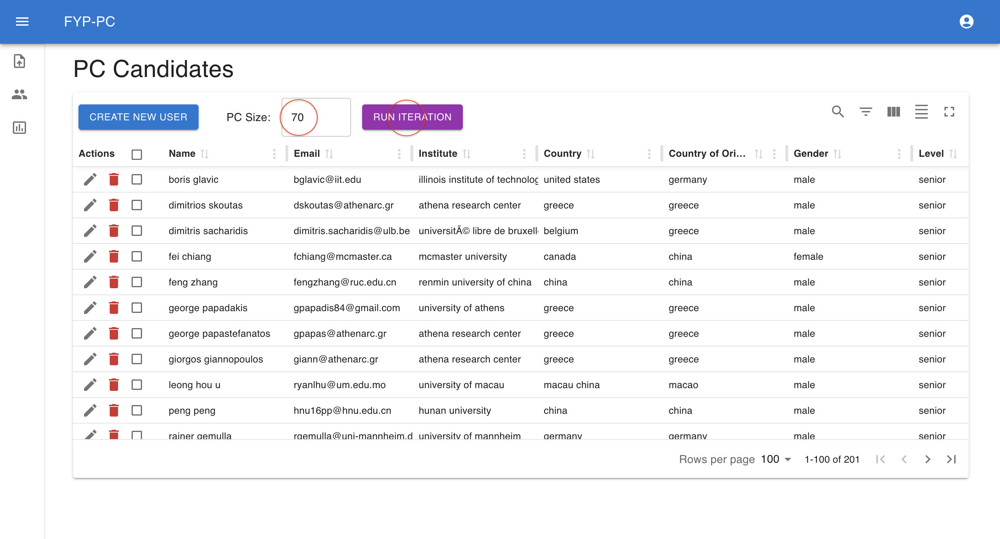
13. The system will evaluate all PC candidates to find the best combination of members with the lowest COI. After getting the best combination, the system will automatically select those candidates. After finalizing the list, the user can send invitations to the selected PC candidates.
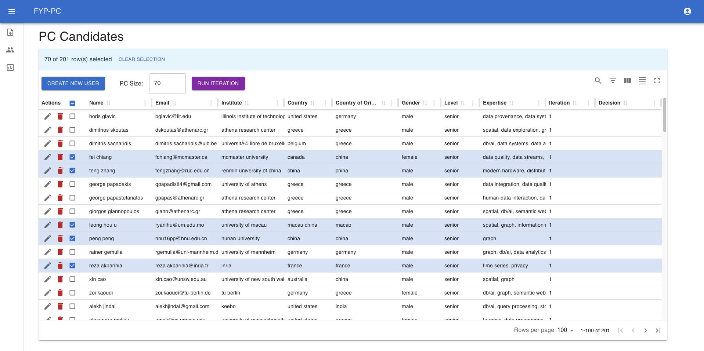
14. Upon receiving responses from the chosen candidates, the user can update the Decision field for the respective rows.
15. The user can then start a second iteration. Only those candidates who were not selected during the first iteration will participate in the second round. The candidates who have accepted are automatically included.
16. After running an iteration, the user can visit the Graph Page to view the results. The Graph Page has 4 tabs. The first tab shows the list of chosen candidates and the number of connections they have with other candidates in a table. The second tab displays the network graph of the chosen candidates. The third tab displays a distribution graph of candidates’ expertise. The fourth tab displays other distribution graphs, country, country of origin, gender, and level.
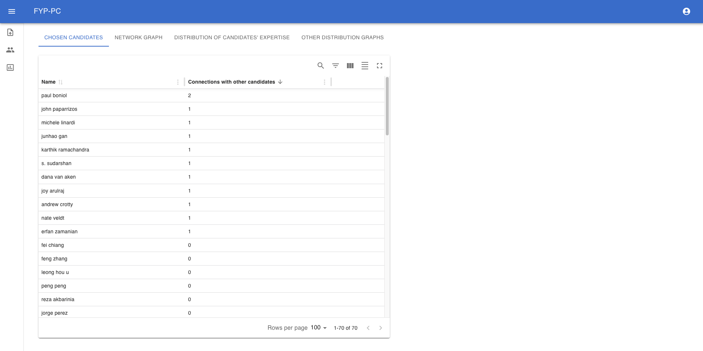
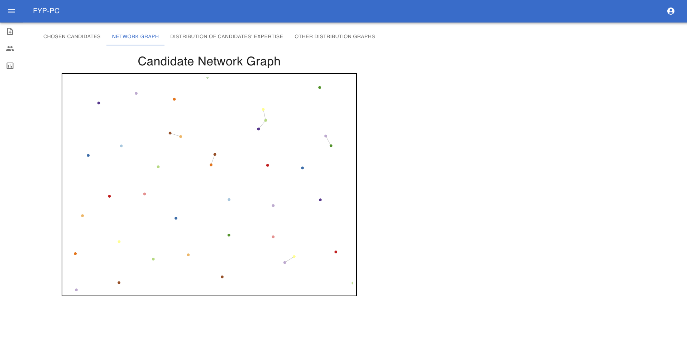
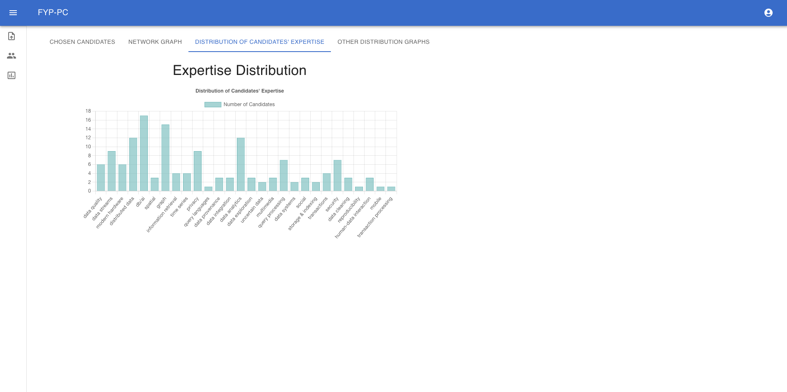
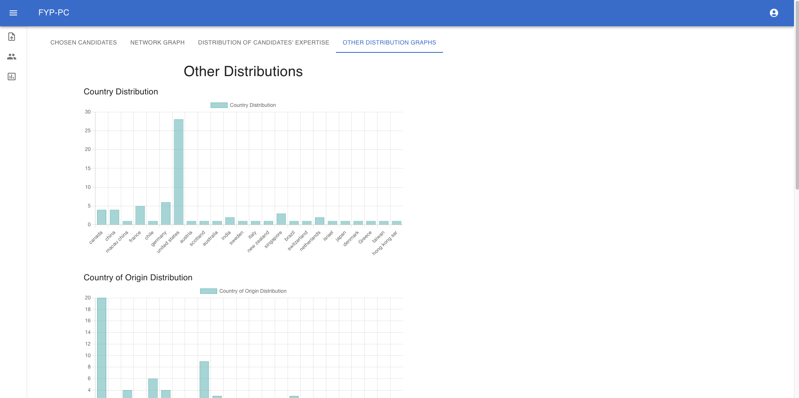
